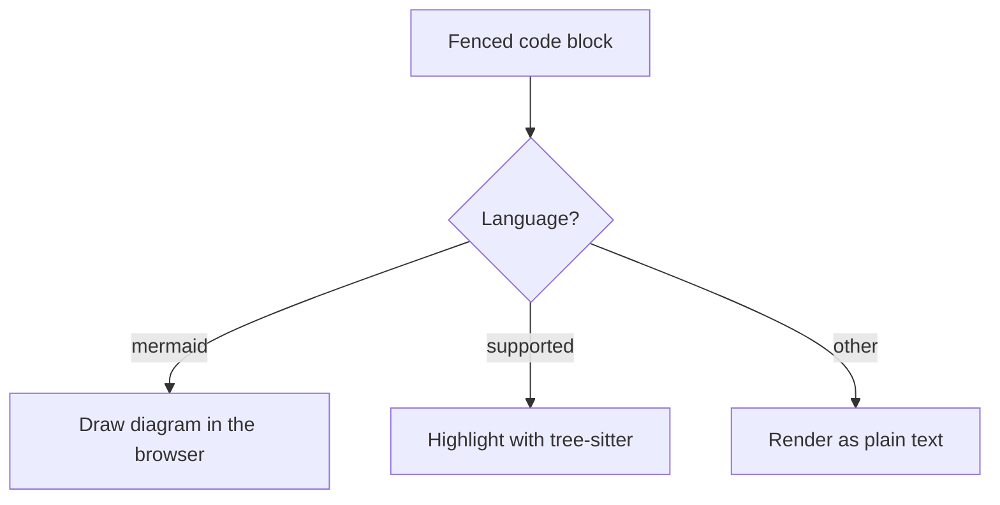
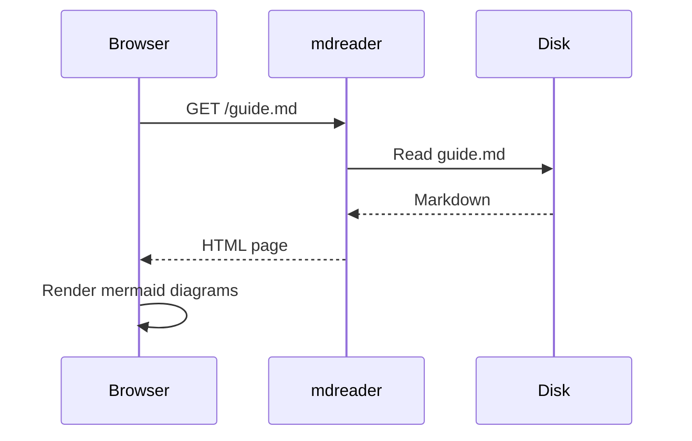
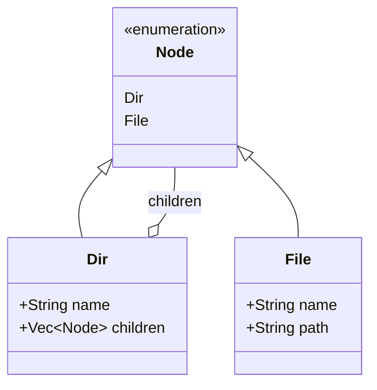
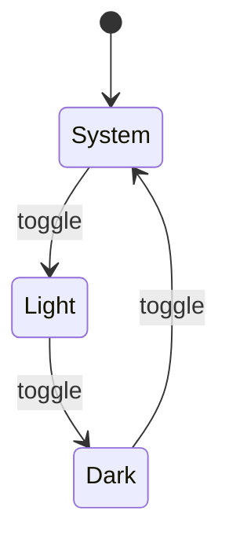
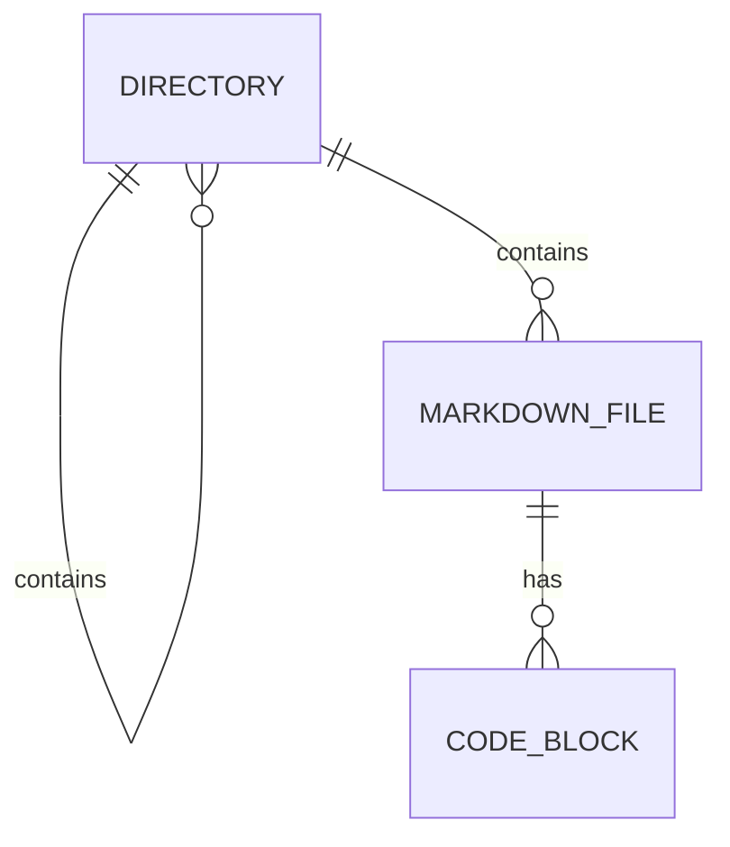
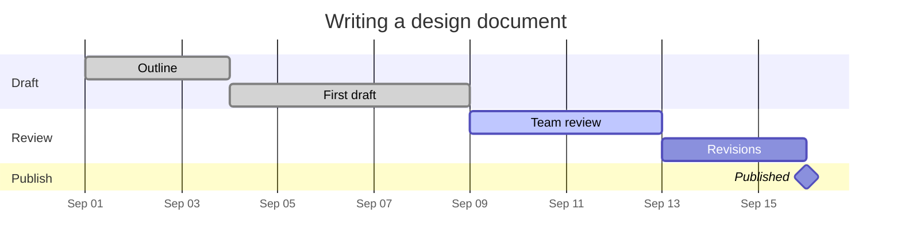
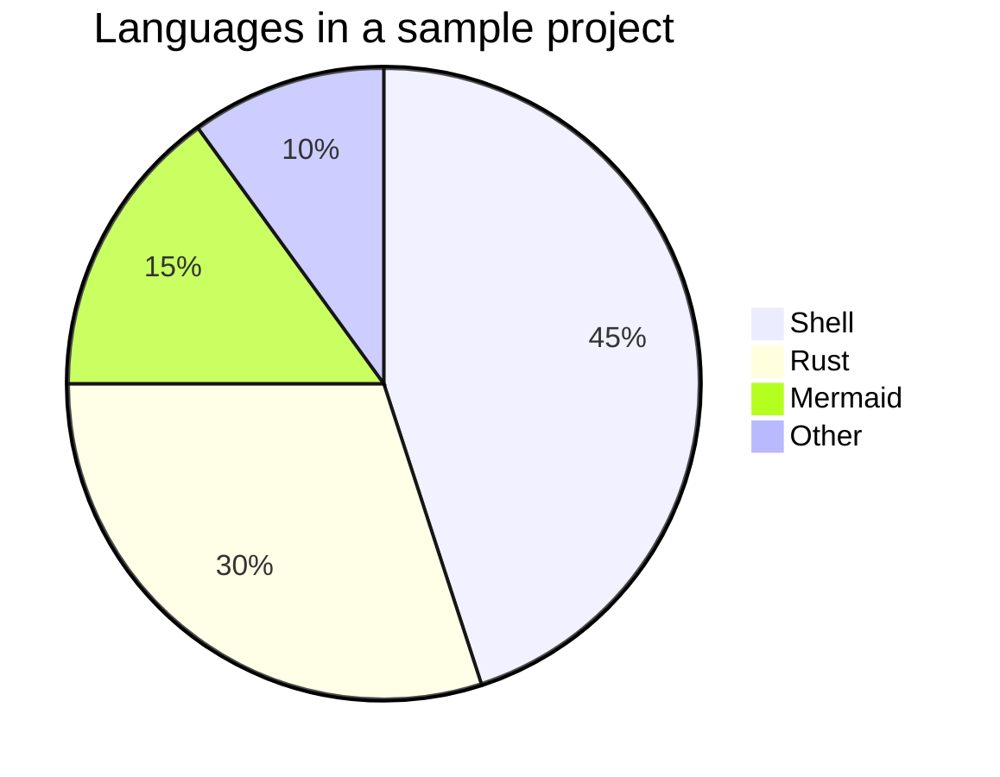

# Mermaid diagrams

Fenced code blocks tagged `mermaid` are drawn as diagrams, following the page theme. Run
`mdreader examples` and open this file to see them rendered.

## Flowchart



## Sequence diagram



## Class diagram



## State diagram



## Entity relationship diagram



## Gantt chart



## Pie chart



## Invalid diagram

A diagram with a syntax error is left as its source text, and the error is logged to the browser
console.

```mermaid
flowchart TD
    A -->
```
